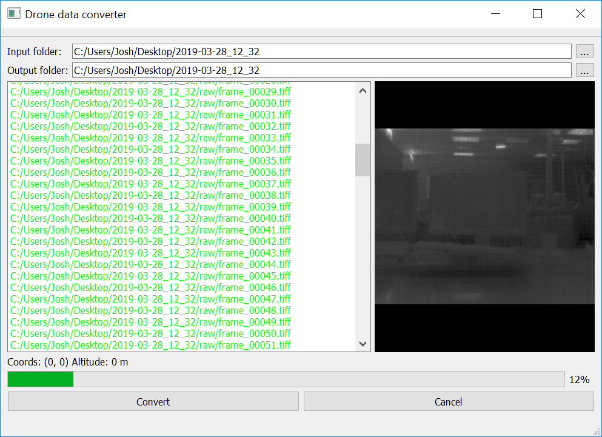

# Data conversion utility for Astro-Ecology thermal/visible drone

This application converts data files captured using visible and thermal cameras.

It is specifically designed to work with the data produced by the Astro-Ecology Raspberry Pi based thermal/visible imaging system.

This is a standalone application. It does not need to be installed, although you may need to run `vc_redistx64.exe` prior to launching the application to install some C++ libraries.

To download the most recent release, please go [here](https://github.com/LJMUAstroecology/drone_data_converter/releases) and download `drone_image_converter.zip`. Extract the zip file and run `data_converter.exe`.

The application is simple: you provide an input folder containing the data files from a flight, and an output folder (by default this is set to the input folder). The output is:

* Three folders: RGB images, preview thermal images (8-bit auto dynamic range) and 16-bit raw thermal images
* An `rgb.avi` and `thermal.avi` video in MJPG format.
* GPS logs for each camera (which you can use with Pix4D)

Clicking "Convert" will begin to convert the data found by the application. You can monitor progress in several ways.

* The log window will show you informative output about what the program is doing, and will indicate if an error has occurred.
* The image window will show you the most recently processed image (useful for quickly seeing a flight played back).
* If there is a valid GPS fix, the coordinates and altitude will be displayed.
* There is an overall progress bar.

Note:

* There _should_ be a `gps.csv` file in your data folder. This is used to generate Pix4D-compatible GPS logs for both thermal and RGB cameras.
* There can be either RGB data files, thermal data files, or both. The program will automatically process each separately.
* For every `thermal_*.dat` file, there _must_ be a corresponding `thermal_offset*.txt` file. If this offset file doesn't exist, the software won't know how to split the raw data into images.
* If only thermal data is present, the output video frame rate is set to 20Hz, otherwise it is set to 7Hz. This corresponds to the setup on the capture system.

